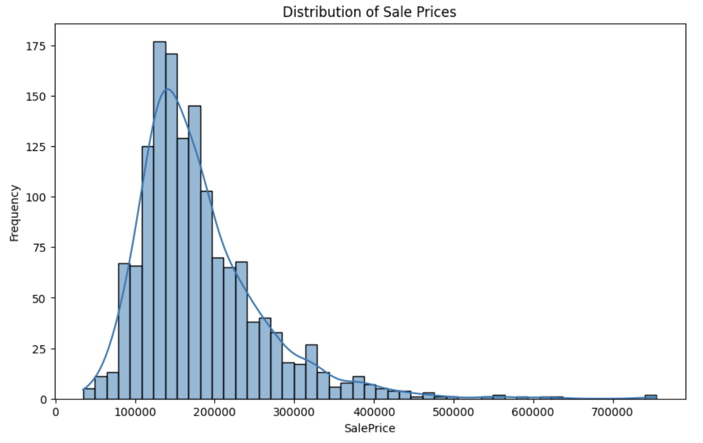
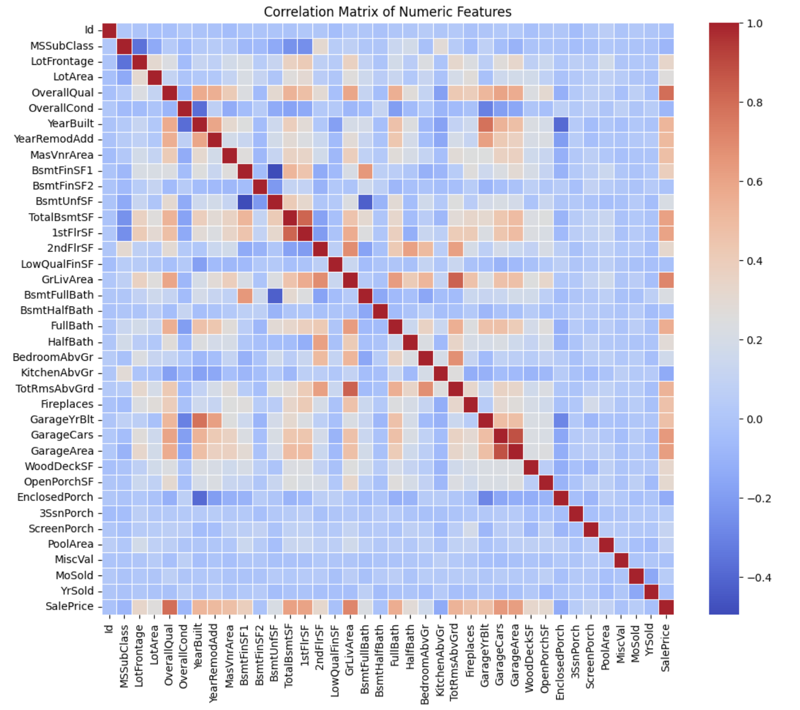

# House Price Prediction Using Linear Regression

## Overview
Buying a home is one of the biggest investments most people make. But what drives the price of a house? This project aims to uncover the hidden patterns behind housing prices by analyzing various features that influence the sale price of homes. Using data analysis and predictive modeling, we provide insights into what potential buyers should focus on when evaluating a property.

---

## Key Findings

### 1. Size Matters, But It’s Not Everything
The size of the house (measured by **GrLivArea**) is strongly correlated with sale price. Larger homes tend to sell for higher prices. However, there’s a limit—homes beyond a certain size (about 4,000 sq ft) don’t always command higher prices at the same rate.

- **Tip for Buyers**: Bigger isn’t always better. After a certain size, the price increase slows down. Look at quality and location as well.

---

### 2. Quality Over Quantity
**OverallQual**, or overall quality of materials and finish, has a very strong correlation with sale price. In many cases, a high-quality smaller home may be priced similarly to a larger home with lower quality.

- **Tip for Buyers**: Prioritize quality over square footage. A well-built home holds its value better over time.

---

### 3. Renovations Boost Value
While the year a house was built has some impact, the year it was **remodeled** has a much stronger effect on price. Homes with modern renovations are more attractive and priced higher.

- **Tip for Buyers**: Renovated homes tend to command higher prices. Look for homes with updated kitchens, bathrooms, or other important areas.

---

### 4. Outdoor Features Count
Homes with well-maintained **outdoor features** like porches, decks, and garages tend to sell for more. Outdoor living spaces are becoming more valued, even if they’re not the first thing people consider.

- **Tip for Buyers**: Don’t underestimate the value of a good outdoor space. It can significantly impact resale value.

---

## Visualizing the Data

### 1. Distribution of Sale Prices
The distribution of sale prices shows that most homes fall between \$100,000 and \$300,000. A small percentage of homes sell for significantly higher prices, creating a slight skew towards the right.

---

### 2. Correlation of Key Features
The heatmap below illustrates the correlation between various features and the sale price. Features like **GrLivArea** and **OverallQual** show the strongest positive correlations with sale price.

---

## Conclusion
This analysis highlights the importance of both size and quality in determining a house's value. However, buyers should focus on more than just square footage. Quality, recent renovations, and outdoor features play an equally significant role in determining price. 

Whether you’re buying your first home or investing in a new property, these insights can help you make more informed decisions.

---

## Tools Used
- **Python** for data analysis
- **pandas**, **NumPy** for data manipulation
- **scikit-learn** for model building
- **matplotlib**, **seaborn** for data visualization
